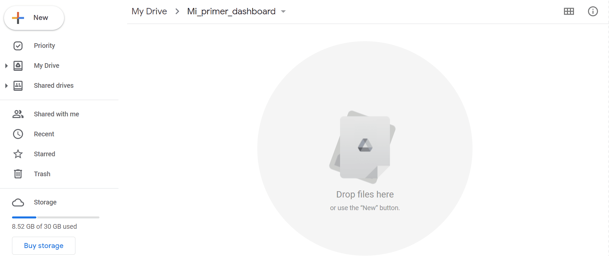
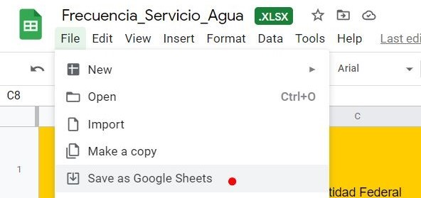
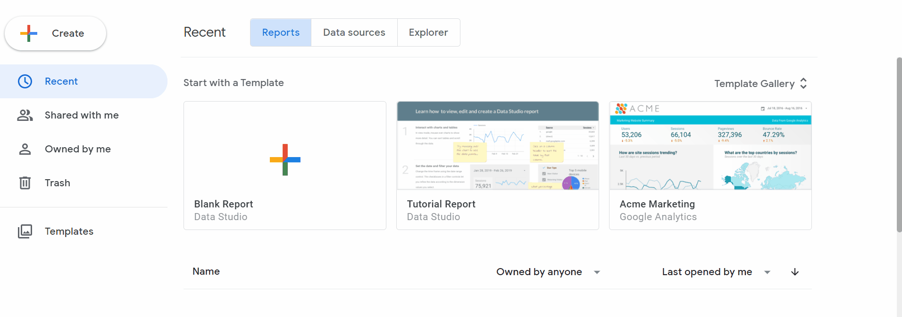
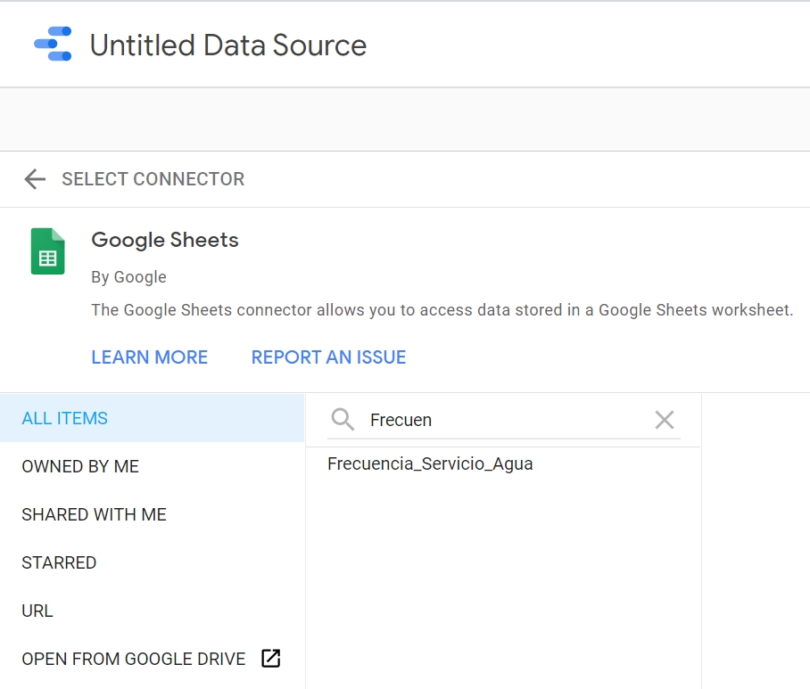
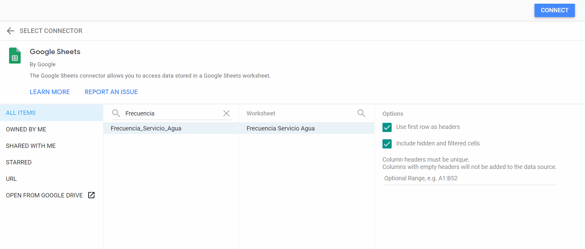
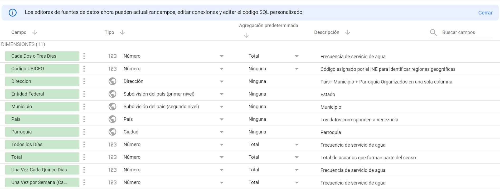
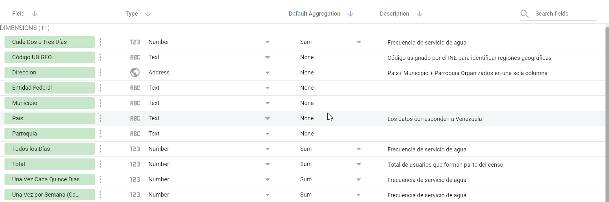
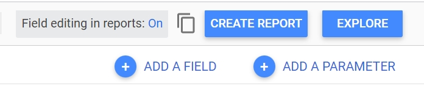
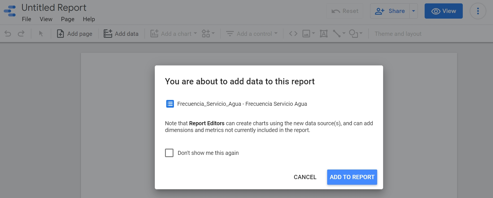
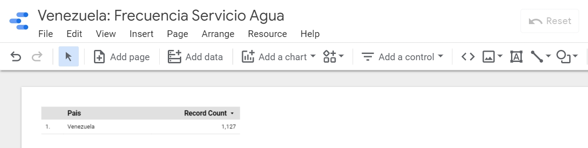

# Google Data Studio

Google Data Studio es una herramienta para desarrollar informes visuales usando herramientas en linea disponible para usuarios con cuentas de Gmail.

Data Studio nos permite diseñar y compartir tableros (Dashboards), donde la data es presentada con gráficos que evocan la atención y facilitan la lectura de la información más relevante.

# Tu primer tablero en Google Data Studio


# Fuentes de datos (Data Source)

Un factor fundamental para la construcción de tableros, es contar con datos organizados y almacenados electrónicamente. 

Data Studio nos permite conectarnos con distintas fuentes de datos entre los que podemos destacar:

- Google sheets (Hojas de datos de Google) almacenadas en Google Drive
- Bases de datos SQL (Structured Query Language)
- Google Analytics, Google Ads, Google Surveys, Youtube Analytics


# Crear fuente de datos

## Cargar datos a Google Drive: 

Para fines de este ejercicio, nos vamos a enfocar en crear una fuente de datos a partir de información estructurada en Google Sheets o en una hoja de Excel. Trabajaremos con datos publicados por el INE (Instituto Nacional de Estadísticas) en 2011, con la intención de medir la frecuencia de acceso al agua en los hogares Venezolanos.

Pasos a seguir: 

- Abrir Google Drive y crear una carpeta dedicada a tu proyecto en Google Data Studio. Ejemplo: `Mi_primer_dashboard`
- Abrir la carpeta `Mi_primer_dashboard` y cargar el archivo de excel `Frecuencia_Servicio_Agua.xlsx`.





- Abrir el archivo de Excel usando Google Sheets 
- Guardar el archivo pero ahora en el formato Google Sheets.





## Conectar datos con Google Data Studio


Luego de completar los pasos previos, podemos ir la [página de Google Data Studio](https://datastudio.google.com/) y crear la fuente de datos. Trabajar con la data almacenada en Google Drive nos permite ciertas ventajas entre las que destacan:


- Los datos son almacenados online
- Distintos usuarios con permisos a leer o modificar la data pueden tener acceso a la información
- La fuente de datos, se puede actualizar automáticamente cada cierto tiempo
- El dashboard creado a partir de la fuente de datos puede ser compartido y visualizado on-line
- Facilidad de conexión con productos de Google.





Buscamos el archivo `Frecuencia de servicio de agua` y lo seleccionamos.




Luego generamos la conexión y después de unos segundos si la conexión es exitosa, Data Studio muestra una vista previa de la estructura de la data.





## Editor de fuente de datos

Dediquemos un momento a explicar en detalle los valores mostrados justo después de conectar con la hoja de datos:

- `Field (Campos)`: Representa cada uno de los campos encontrados. En este caso, existen un total de 11 dimensiones que representan cada columna en la hoja de datos.
- `Type`: Indica el formato en que los datos son interpretados, por ejemplo el campo `Cada dos o tres dias`es interpretado como tipo `number` o `Pais` es tipo `Geo`.
- `Default Aggregation`: Representa operaciones matemáticas aplicadas a los datos para facilitar su representación, por ejemplo `sum` puede representar la suma de todos los habitantes que reciben el servicio de agua en una ciudad en particular. 
- `Description`: Permite explicar con mayor detalle los campos.

Ahora, pasamos a editar algunos campos a conveniencia, brindando especial atención al formato `Type` en que la data es interpretada. Indicar el tipo correcto de data, facilita el trabajo al momento de construir el tablero.

- Modifica el formato de los datos y su descripción para obtener un resultado como el mostrado a continuación:



```
- Cómo modificar el formato de los datos ?

Puedes seleccionar el formato de los datos a conveniencia, `Currency`, `Text`, `number`, `Geo` (moneda, texto, número, geo, etc). Particularmente el formato `Geo`, facilita la conexión con servicios de Google Maps.
```



## Crear informe

Una vez que el formato de datos ha sido modificado, click en `Create report` para dar inicio al diseño del reporte.



Luego debemos autorizar a la aplicación a conectarse con los datos:



Finalmente, actualiza el nombre del tablero a preferencia, por ejemplo `Venezuela: Frecuencia Servicio Agua`



## Oficialmente, has completado los primeros pasos para crear un dashboard en Google Data Studio. Estas listo para el siguiente reto ?


## Enlaces a datos INE

[Datos demográficos INE: Proyeccion poblacion](http://www.ine.gov.ve/index.php?option=com_content&view=category&id=98&Itemid=51)

[Datos demograficos acceso a servicios](http://www.ine.gov.ve/index.php?option=com_content&view=category&id=95&Itemid=9)