# Diseño de dashboard


Luego de generar la fuente de datos y crear el informe, estamos listos para representar gráficamente los datos. La vista inicial del informe puede variar de tu configuración, pero en general podemos identificar las siguientes regiones:


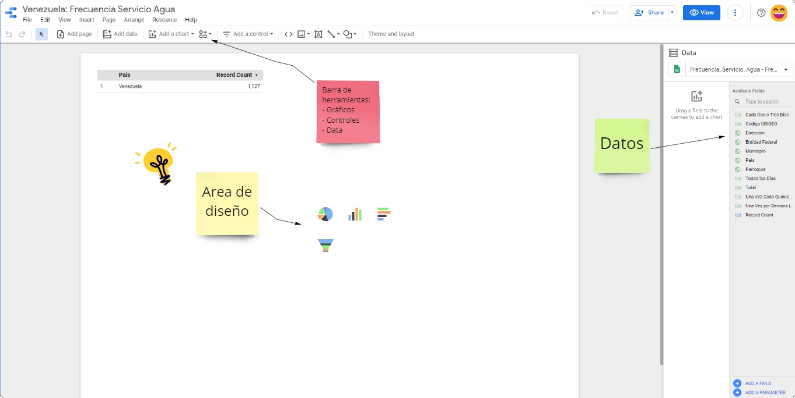


En este capítulo vamos a explorar las principales funciones para construir un dashboard en Data Studio y ejemplos de gráficos. Puedes seguir los ejemplos para familiarizarte con la herramienta pero también tienes libertad de diseñar el tablero de la forma que te parezca más conveniente para contar la historia detrás de los datos.


# Tu primer gráfico


Para facilitar el trabajo, la aplicación nos permite arrastrar y soltar (drag and drop) los campos de interés en el área de diseño. Por ejemplo, si arrastramos el campo `Direccion` cuyo formato fue definido previamente como `Geo`, Data Studio generará automáticamente un gráfico que se ajuste a representar los datos.


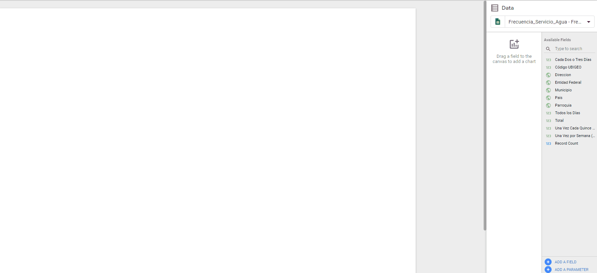


Luego puedes arrastrar el gráfico y ajustar las dimensiones según prefieras.


Una de las ventajas de trabajar con datos de tipo `Geo` en Data Studio es que la herramienta ofrece integración directa con Google Maps. Por ejemplo, podemos visitar virtualmente el monumento a la Virgen de la Paz o el mar Caribe.


# Tabla de datos


Una buena práctica antes de generar gráficos, es previsualizar en una tabla los datos de interés, esto nos permite asegurar que los campos y valores de interés son correctamente representados. Además en otras ocasiones también puede ser útil presentar los datos en tablas. El panel de herramientas `Data` ubicado a la derecha del tablero incluye distinto campos entre los que destacan `Dimension` y `Metric`, en gran parte de los casos, estos serán los campos fundamentales para generar una tabla o gráfico, luego dependiendo de la complejidad del gráfico, la aplicación indicará más opciones.


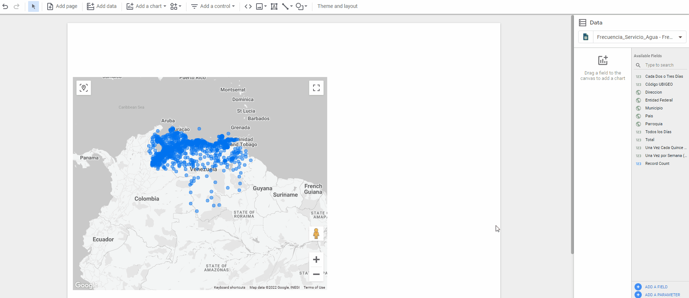


# Gráficos (Charts)


Data Studio ofrece distintas opciones entre las cuales podemos elegir a conveniencia. Para visualizar las opciones, click en `Add chart` (Agregar Gráfico)


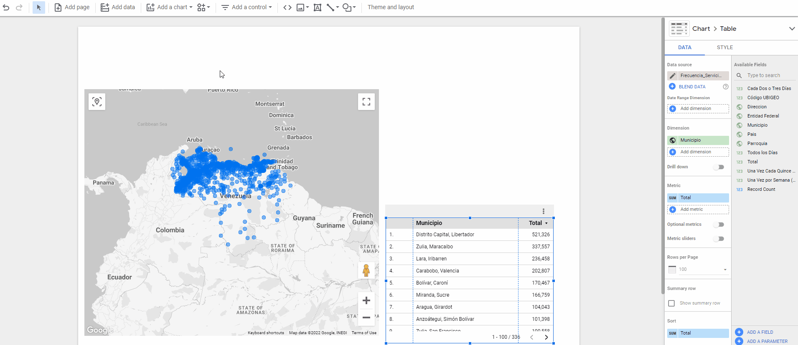


# Gráfico de barras


A continuación, vamos a construir un gráfico de barras. En este caso vamos a comparar la frecuencia de servicio de agua por estado del país y observar la relación de hogares que reciben el servicio de agua todos los días en comparando con el total de encuestados.

Campos a graficar:

- Dimension: `Entidad Federal`
- Metrics: `Total`, `Todos los dias`


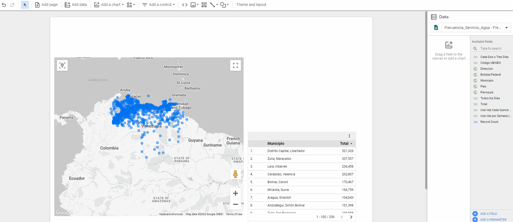


## Filtrar datos en gráficos

En algunas ocasiones, visualizar mucha información puede desviar la atención de nuestra audiencia. Por ejemplo, en el caso del gráfico de barras previamente creado, se muestran diez estados pero es difícil leer a simple vista cuáles. Aplicaremos un filtro al gráfico para presentar gráficamente sólo los tres estados con la mayor cantidad de hogares encuestados.


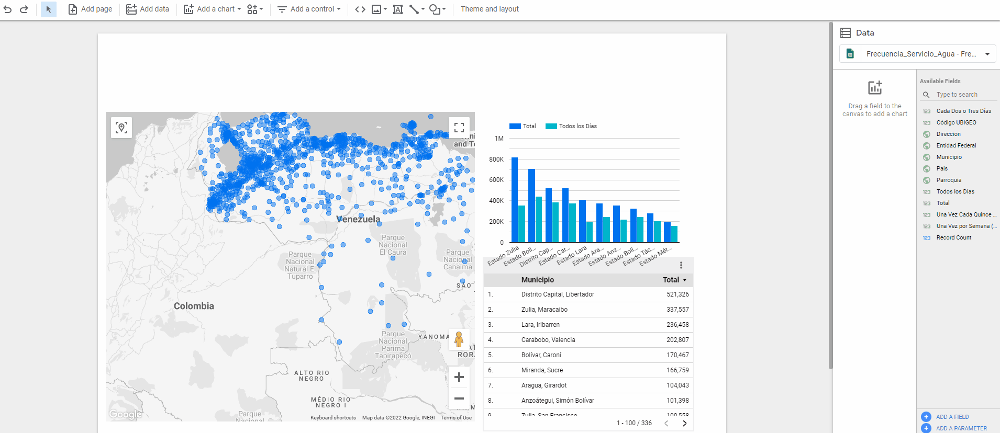


# Controles


El dashboard empieza a tomar forma pero hasta ahora estamos representando toda la información en el mapa. En ocasiones, es más conveniente para los usuarios buscar y representar valores de interés. Por ejemplo, podemos comparar la frecuencia del servicio de agua en Mérida vs Nueva Esparta ?

En este caso, el uso de controles, brinda a los usuarios de nuestro tablero la capacidad de visualizar los valores de mayor interés.

Campos a utilizar para controles:

- `Entidad Federal`

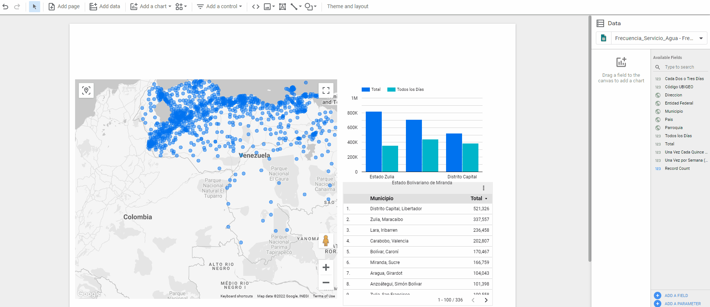


# Indicadores


Imagina que queremos un indicador para evaluar la calidad del servicio y decidimos visualizar la relación de hogares que recibe agua todos los días. Podemos representar esto con un gráfico similar al indicador del nivel de gasolina de un carro, lo que nos facilita visualizar rápidamente cuán lejos o cerca estamos del valor ideal.

Campos a utilizar para el indicador:

- Tipo de gráfico: `Gauge` (Indicador)
- Data Range Dimension: `Total`
- Metric: `Todos los dias` 


Ahora, queremos agregar otro indicador pero esta vez para representar mala calidad en el servicio, utilizaremos de nuevo un indicador pero de color rojo para advertir visualmente la cantidad de hogares que reciben agua `Una vez cada quince días`

Campos a utilizar para el indicador:

- Tipo de gráfico: `Gauge` (Indicador)
- Data Range Dimension: `Total`
- Metric: `Una vez cada quince días` 

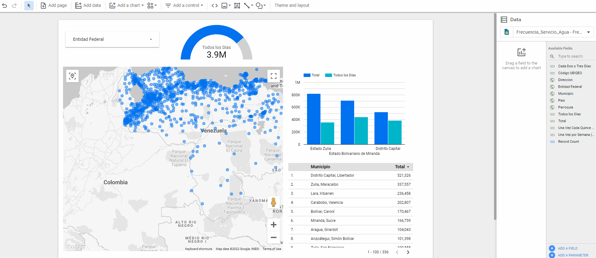

````
Personalización adicional de indicadores:

El indicador puede ser complementado agregando rangos (range) y un valor objetivo (target). Puedes seleccionar el indicador de interés y luego definir en `style` (estilo) los rangos que desees fijar o el target de interés (para ello puedes habilitar la opción `show target` disponible en el menú `style` del indicador).
````

También podemos complementar los indicadores agregando una `Tarjeta de puntuación` (Scorecard), por ejemplo para representar el total de viviendas que forman parte de la muestra.


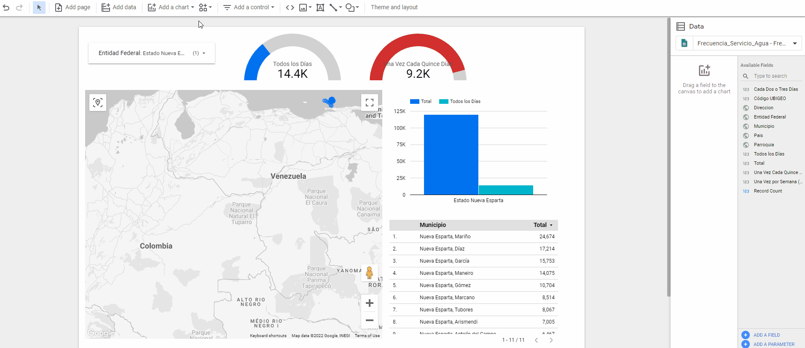


# Ejercicios adicionales:

```
Reto 1:

Modifica el gráfico de barras para mostrar la frecuencia de servicio de agua, total, todos los días y cada dos o tres días.
```

Elige un estado del país y utiliza el controlador para visualizar la información que corresponde sólo a ese estado. Por ejemplo, para Nueva Esparta, se puede observar que más de 9.000 hogares reciben el servicio de agua una vez cada quince días y que en la mayoría de los hogares la frecuencia del servicio es de cada dos o tres días.  

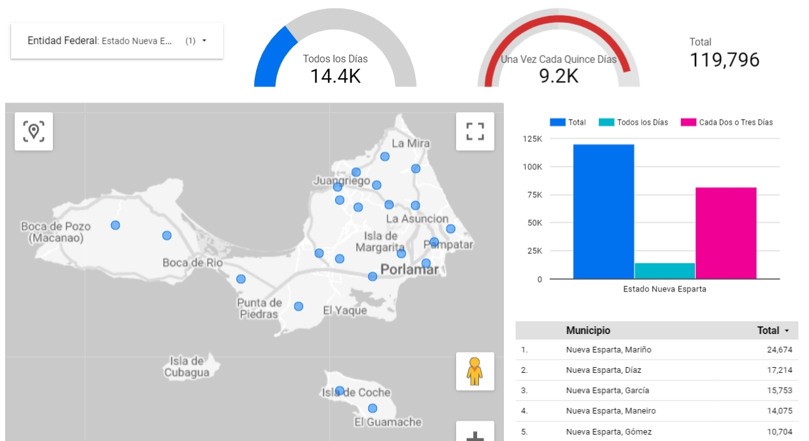

````
Reto 2:

Podemos brindar a los usuarios, la posibilidad de seleccionar `Entidad Federal`, `Municipio` y `Parroquia`. Para ello, sólo necesitas agregar controladores adicionales.

Intenta agregar dos controladores extra, la siguiente imagen muestra un ejemplo de cómo luce el tablero actualizado:

- Tipo de controlador : Drop-down list
- Campos de control (Control Field): `Municipio` y `Parroquia`
````

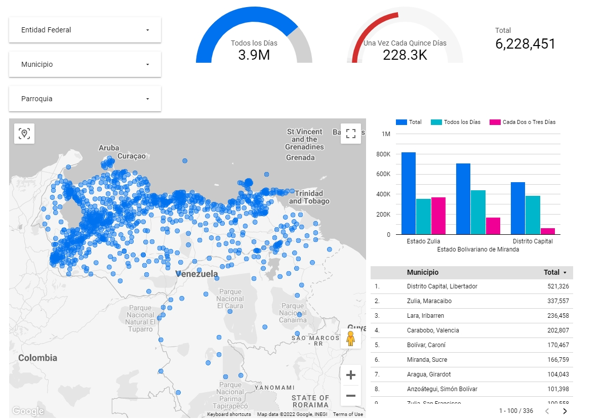

# Felicitaciones!

Has construido tu primer tablero en Google Data Studio


