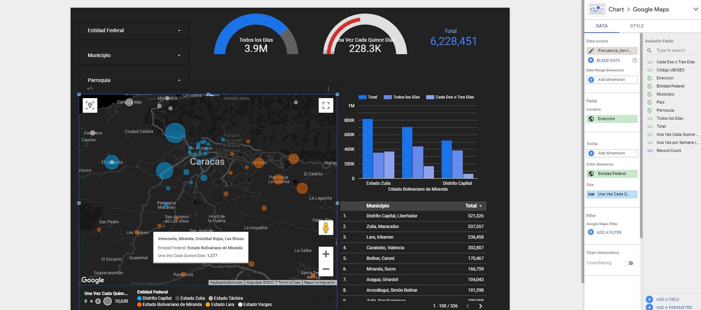

# Personalización Tablero

El principal objetivo de un dashboard es facilitar la representación de datos. Idealmente, buscamos crear gráficos atractivos y ricos en información. Diseñar un tablero, es un proceso intelectual pero también creativo en el que podemos tomar ventaja del uso de colores, fuentes y elementos interactivos.

# Tema y diseño (Theme and Layout)

La opción rápida es seleccionar temas pre-diseñados por Data Studio. La aplicación nos permite elegir entre varias paletas de colores y modificar valores relacionados al encabezado, margen, alineación, etc.

- Explora los temas disponibles y elige uno de tu preferencia.


# Estilo de gráficos

Dependiendo del gráfico, distintas variables pueden ser modificadas para cambiar el estilo a conveniencia. Entre las posibles opciones podemos destacar:

- Cambiar colores en que los datos se representan
- Ajustar posición de títulos y leyendas
- Cambiar fuentes
- Agregar o remover texto (Títulos, nombre de ejes...)

El estilo puede ser modificado de la siguiente forma:

1. Click en el gráfico de interés
2. En la barra lateral derecha, seleccionar la pestaña `STYLE`
3. Modificar los valores a conveniencia.

A continuación, presentamos un ejemplo para modificar el estilo de la `Tarjeta de puntuación` (Scorecard):


# Modificar gráficos previamente creados

En algunos casos, luego de crear un gráfico puede que necesitemos mejorar su apariencia para representar los datos de una forma más amigable para el usuario. En general, al hacer click en el gráfico que se desea modificar, aparece la barra lateral derecha y con ella las distintas opciones para modificar `Data`, `Style` o tipo de gráfico.

Por ejemplo:


````
Tip: Cuando diseñes un tablero, siempre ten en mente al usuario y la forma en que va a interactuar con el tablero de información. Imagina que la información va a ser presentada al CEO de una firma global que debe tomar decisiones en base a los datos presentados en el dashboard. Al CEO le gustaría, leer toda la información necesaria cada mañana mientras se toma un café.
````

# Ejemplo: Personalización de mapa

La visualización del mapa de Venezuela y los puntos representando distintas Parroquias es muy atractiva para el usuario. Podemos representar más información en el mismo gráfico ? Sí! Por ejemplo, podemos asignar un color distinto a cada estado del país.

- Click en el gráfico del mapa
- En el panel derecho, pestaña `Data` dirígete a la opción `Tooltip`
- Arrastra el campo `Entidad Federal` y suéltalo en el área `Color Dimension`
- Luego de unos segundos, el mapa se actualiza asignando un color distinto a cada estado.


En el mapa, también podemos modificar el tamaño de las burbujas según deseemos. Digamos que queremos enfatizar las Parroquias en dónde el servicio de agua tiene una frecuencia de `una vez cada quince días`, podemos asignar burbujas de mayor tamaño en las regiones más afectadas.

- Click en el gráfico del mapa
- En el panel derecho, pestaña `Data` dirígete a la opción `Tooltip`
- Arrastra el campo `Una vez Cada Quince Días` y suéltalo en el área `Size`
- Luego de unos segundos, el mapa se actualiza con burbujas de diferentes dimensiones.





# Agregar Texto e imágenes

También podemos personalizar el dashboard agregando imágenes almacenadas en nuestro ordenar o publicadas en un sitio web. La información puede ser complementada con texto para indicar un título por ejemplo.


Luego de agregar la información, siempre puedes modificar la posición de los distintos elementos para presentar el tablero según preferencias.


# Agregar página

El tablero puede constar de varias páginas, especialmente en casos donde el objetivo es crear reportes completos y detallados de la información.


