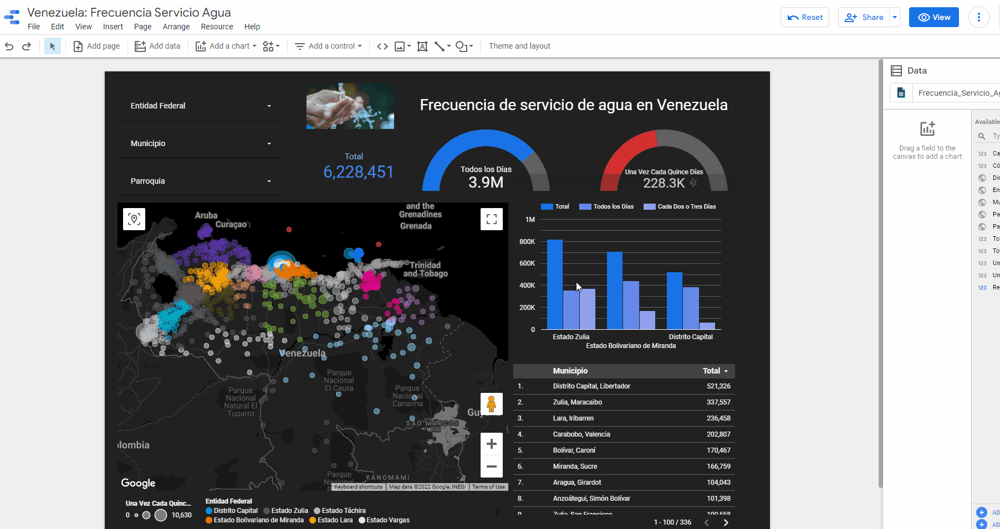
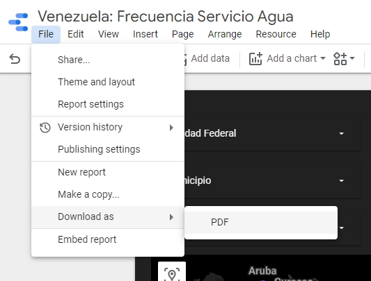

# Compartir Tablero

Una vez finalizada la construcción de tu dashboard es momento de compartir tu trabajo con colegas, personas o instituciones interesadas en la información.

De qué formas puedo compartir la información?

- Una de las principales ventajas de trabajar con Data Studio es que puedes compartir el dashboard via URL, es decir, la información estará disponible on-line para cualquier usuario que tenga acceso.
- Los permisos de acceso se otorgan a otros usuarios con cuentas Gmail y se puede configurar para otorgar permisos de sólo lectura o de edición.
- En caso de que desees que el tablero sea totalmente público, entonces puedes definir el acceso para cualquier usuario que tenga la URL.
- Además, puedes exportar el tablero y guardarlo en un archivo `pdf`.

# Compartir tablero via link y permisos de acceso


- Click en `Compartir` (Share)
- Si deseas agregar colaboradores o usuarios, puedes agregar su dirección de gmail y el nivel de acceso que tendrá el usuario (`Puede ver`, `Puede ver y editar`).

- En caso de que desees compartir via link url , click en `Gestionar Accesso` (Manage access)
- Distintas opciones son disponibles para gestionar el acceso via link, entre ellas destacan:

```
- Cualquier usuario de internet puede encontrarlo y verlo
- Cualquier usuario de internet puede encontrarlo y editarlo
- Cualquier persona con el enlace puede verlo
- Cualquier persona con el enlace puede editarlo
- Desactivado: solo pueden acceder usuarios específicos
```

[En el siguiente link](https://datastudio.google.com/reporting/b695e325-98e6-473a-b6b8-21185febafec), puedes encontrar un ejemplo de tablero para tu referencia. Está diseñado con los mismos datos de frecuencia de servicio de agua y sólo los usuarios con el link tienen permiso para ver pero no para editar, copiar ni compartir.

```
⚠️

- Ten cuidado al asignar permisos, sólo mienbros del equipo a cargo de construir y mantener el dashboard deben tener permisos de edición.
- Si los datos representados en el tablero son confidenciales, aseguráte que unicamente las personas con autorización tienen acceso al tablero.
```



# Exportar reporte a formato pdf

En el caso de necesitar un informe pdf con los gráficos presentados puedes exportar el informe a formato `pdf`, la desventaja de este método es que perdemos las herramientas interactivas.




